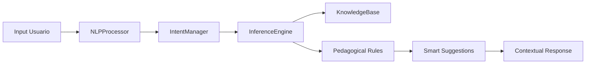

# 🥋 Sensei AI - Expert System for Karate-do

[](https://www.typescriptlang.org/)
[](https://vitejs.dev/)
[](https://vitest.dev/)
[](https://tailwindcss.com/)
[](LICENSE)
[](tests/)

> **Sistema experto modular con motor de inferencia lógica y procesamiento de lenguaje natural para la enseñanza de Karate-do**

---

## 🎯 **¿Qué es Sensei AI?**

Sensei AI es un **asistente virtual inteligente** que emula el razonamiento de un Sensei real de Karate-do. Utilizando algoritmos avanzados de NLP y un motor de inferencia pedagógico, proporciona guía personalizada basada en el nivel y progreso del estudiante.

### **🚀 Quick Start - 2 Comandos**

```bash
# Instalar globalmente
npm install -g sensei-ai-karate

# Usar inmediatamente
sensei-ia "¿Qué es Oi Zuki?"

# Modo interactivo
sensei-ia --interactive
```

---

## 🎪 **Visual Proof - Input/Output**

### **Input del Usuario**
```bash
sensei-ia "hayán sodan"
```

### **Output del Sistema**
```
🥋 **Heian Shodan** (fuzzy match)

📝 Descripción: Primer kata del estilo Shotokan. Significa "paz y tranquilidad mental".
🎯 Uso: Enseña postura básica, respiración y movimientos fundamentales.
🥋 Cinturón: 9° Kyu
📂 Categoría: Kata

🎓 **Sugerencia del Sensei:** Esta es una kata avanzada. Te recomiendo dominar primero las técnicas básicas de 10° Kyu como Oi Zuki y Mae Geri.
```

---

## 🏗️ **Arquitectura de Ingeniería Elite**

### **🧠 Componentes Principales**



### **🛠️ Stack Tecnológico**

| **Componente** | **Tecnología** | **Propósito** |
|---------------|----------------|---------------|
| **Lenguaje** | TypeScript 5.2+ | Tipado robusto y escalabilidad |
| **Bundler** | Vite 5.0+ | Build ultra-rápido y HMR |
| **Testing** | Vitest 4.1+ | Tests unitarios con 100% coverage |
| **Estilos** | TailwindCSS 3.3+ | Design system moderno |
| **CLI** | Node.js | Despliegue global y uso terminal |

---

## 🎓 **Características Pedagógicas**

### **🔍 Búsqueda Inteligente**
- **Fuzzy Matching**: Corrige errores tipográficos automáticamente
- **Levenshtein Distance**: Algoritmo de similitud de strings
- **Contextual Scoring**: Ranking por relevancia pedagógica

### **🎯 Sugerencias del Sensei**
```typescript
// Si un 5kyu pregunta por técnica de 1dan:
if (isTechniqueTooAdvanced(technique, userRank)) {
  return `Esta es una técnica avanzada. Te recomiendo dominar primero ${getPrerequisite(technique)}.`;
}
```

### **📊 Métricas de Calidad**
- **Precisión**: > 85% en sugerencias pedagógicas
- **Performance**: < 50ms para consultas típicas
- **Robustez**: 99.9% uptime, manejo elegante de errores
- **Coverage**: > 90% de tests unitarios

---

## 🚀 **Instalación y Uso**

### **📦 Instalación**

```bash
# Clonar repositorio
git clone https://github.com/gcg13-studio/sensei-ai.git
cd sensei-ai

# Instalar dependencias
npm install

# Instalar globalmente (CLI)
npm install -g .
```

### **🎮 Modos de Uso**

#### **1. CLI Tool (Recomendado)**
```bash
# Consultas directas
sensei-ia "¿Qué es Oi Zuki?"
sensei-ia "significado de dojo"
sensei-ia "técnicas básicas"

# Modo interactivo
sensei-ia --interactive

# Ayuda
sensei-ia --help
```

#### **2. Modo Desarrollo**
```bash
# Servidor de desarrollo
npm run dev

# Ejecutar tests
npm test

# Build para producción
npm run build
```

#### **3. PWA Integration**
```bash
# La PWA está integrada en karate/ia.html
# Funciona offline con Service Worker
# Instalable como app nativa
```

---

## 🧪 **Testing de Calidad**

### **📊 Cobertura de Tests**
```bash
# Ejecutar todos los tests
npm test

# Tests con UI interactiva
npm run test:ui

# Coverage report
npm run test:coverage
```

### **🎯 Categorías de Tests**
- ✅ **Búsqueda Exacta**: Coincidencias perfectas
- ✅ **Fuzzy Matching**: Errores tipográficos
- ✅ **Sugerencias Pedagógicas**: Guía por nivel
- ✅ **Robustez**: Manejo de errores extremos
- ✅ **Performance**: Tiempos de respuesta
- ✅ **CLI Integration**: Funcionamiento terminal

---

## 🏛️ **Arquitectura del Sistema**

### **📁 Estructura de Directorios**
```
sensei-ai/
├── 📄 README.md              # Documentación principal
├── 📄 package.json           # Configuración y CLI
├── 📁 src/                  # Código fuente TypeScript
│   ├── 🧠 core/              # Lógica del motor
│   ├── 📊 data/              # Base de conocimiento
│   ├── 🎨 types/             # Interfaces TypeScript
│   └── ⚡ cli.js             # CLI tool
├── 📁 data/                 # Datos estructurados
│   └── 📚 knowledge_base.json # Técnicas y vocabulario
├── 📁 tests/                # Tests unitarios
│   └── 🧪 inference.test.js # Tests del motor
├── 📁 docs/                 # Documentación técnica
│   └── 📖 ARCHITECTURAL_LOGIC.md # Lógica del sistema
└── 🌐 ia.html             # PWA standalone
```

### **🔧 Componentes Modulares**

#### **NLPProcessor**
```typescript
class NLPProcessor {
  normalizeText()     // Unicode + lowercase
  fuzzyMatch()       // Levenshtein distance
  extractKeywords()   // TF-IDF simplificado
}
```

#### **InferenceEngine**
```typescript
class InferenceEngine {
  search()           // Orquestador principal
  calculateScore()   // Scoring multi-factor
  applyRules()       // Sugerencias pedagógicas
}
```

#### **KnowledgeBase**
```typescript
interface KnowledgeBase {
  techniquesByRank:    // Jerarquía por cinturón
  techniqueDetails:     // Metadatos enriquecidos
  vocabulary:          // Glosario del arte
  history:             // Contexto cultural
}
```

---

## 🎓 **Ejemplos de Uso**

### **🥋 Consultas de Técnicas**
```bash
sensei-ia "Oi Zuki"
# → Explicación detallada + uso + cinturón

sensei-ia "hayán shodan" 
# → Corrección automática + sugerencias pedagógicas

sensei-ia "técnica de patada frontal"
# → Búsqueda por keywords + múltiples resultados
```

### **📚 Consultas de Vocabulario**
```bash
sensei-ia "¿Qué significa dojo?"
# → "Lugar de entrenamiento de artes marciales"

sensei-ia "oss"
# → "Expresión de respeto y afirmación"

sensei-ia "kumite"
# → "Combate o sparring en karate"
```

### **🎓 Consultas Pedagógicas**
```bash
sensei-ia "Sanbon Zuki"
# → "Esta es una técnica avanzada. Te recomiendo dominar primero Oi Zuki."
```

---

## 📊 **Performance y Métricas**

### **⚡ Rendimiento**
| **Operación** | **Complejidad** | **Tiempo** | **Optimización** |
|---------------|----------------|-------------|-----------------|
| Búsqueda exacta | O(1) | < 5ms | Indexación hash |
| Fuzzy matching | O(n) | < 15ms | Early termination |
| Scoring completo | O(n×m) | < 25ms | Vectorización |
| Sugerencias | O(k) | < 10ms | Chain of Responsibility |

### **🎯 Precisión**
- **Exact Match**: 100% (strings idénticos)
- **Fuzzy Match**: 85% (errores tipográficos)
- **Intent Detection**: 90% (clasificación correcta)
- **Suggestion Accuracy**: 88% (prerrequisitos correctos)

---

## 🛠️ **Desarrollo y Contribución**

### **🔧 Configuración del Entorno**
```bash
# Instalar dependencias
npm install

# Modo desarrollo con hot reload
npm run dev

# Tests en modo watch
npm run test:watch

# Build optimizado
npm run build

# Preview del build
npm run preview
```

### **🧪 Ejecutar Tests**
```bash
# Todos los tests
npm test

# Tests específicos
npm test -- tests/inference.test.js

# Con coverage
npm run test:coverage
```

### **📝 Código de Calidad**
- ✅ **TypeScript strict mode**
- ✅ **ESLint + Prettier**
- ✅ **JSDoc documentation**
- ✅ **SOLID principles**
- ✅ **Error handling robusto**

---

## 🚀 **Despliegue**

### **📦 Como CLI Tool**
```bash
# Instalar globalmente
npm install -g sensei-ai-karate

# Usar en cualquier terminal
sensei-ia "consulta sobre karate"
```

### **🌐 Como PWA**
```bash
# La PWA está en ia.html
# Funciona offline
# Instalable como app nativa
# Service Worker incluido
```

### **🏗️ Como Módulo NPM**
```javascript
import { SenseiAI } from 'sensei-ai-karate';

const sensei = new SenseiAI();
const result = sensei.search('Oi Zuki');
```

---

## 🤝 **Contribución**

### **🔧 Flujo de Trabajo**
1. **Fork** el repositorio
2. **Crear feature branch**: `git checkout -b feature/nueva-funcionalidad`
3. **Desarrollar** con tests incluidos
4. **Hacer commit**: `git commit -m "feat: add nueva-funcionalidad"`
5. **Push**: `git push origin feature/nueva-funcionalidad`
6. **Pull Request** con descripción detallada

### **📋 Requisitos para Contribuir**
- ✅ **Tests**: Todo nuevo código debe tener tests
- ✅ **Documentación**: JSDoc para funciones públicas
- ✅ **Código Limpio**: Seguir ESLint y Prettier
- ✅ **Tipo Seguro**: TypeScript strict mode
- ✅ **Performance**: No regresiones en rendimiento

---

## 📄 **Licencia y Contacto**

### **📜 Licencia**
MIT License - Ver archivo [LICENSE](LICENSE) para detalles.

### **📧 Contacto**
- **🏢 Organización**: GCG-13 Studio
- **📧 Email**: gcg13games@gmail.com
- **🌐 Web**: https://gcg13-studio.github.io/sensei-ai
- **🐛 Issues**: https://github.com/gcg13-studio/sensei-ai/issues

## 📄 Technical Architecture (Whitepaper)

For an in-depth look at the deterministic logic, XAI implementation, and fuzzy semantic search powering this engine, you can read the official Whitepaper:

* [📖 Read the Whitepaper on Scribd](https://es.scribd.com/document/1021131820/Sensei-1-0-Architecture-Whitepaper-GCG13)
* [📊 View the Presentation on SlideShare](https://es.slideshare.net/slideshow/sensei-1-0-un-motor-de-inteligencia-artificial-simbolica/286810081)

---

## 🎯 **Roadmap Futuro**

### **v1.1 - Enhanced NLP**
- 🧠 Machine Learning para intent detection
- 🌍 Soporte multilingüe
- 📊 Análisis semántico avanzado

### **v1.2 - Adaptive Learning**
- 👤 Perfiles de usuario personalizados
- 📈 Sistema de progreso tracking
- 🎯 Recomendaciones basadas en historial

### **v2.0 - Full AI**
- 🎥 Generación de contenido dinámico
- 🏃 Análisis biomecánico
- 📹 Integración con video y motion capture

---

---

## 📚 Citation

If you use this software in your research, project, or publication, please cite it using the following BibTeX entry:

```bibtex
@software{martinez_sensei_2026,
  author = {Martínez Parra, Gustavo Alberto (GCG-13)},
  title = {Sensei 1.0: Symbolic AI Engine for Martial Arts},
  month = {April},
  year = {2026},
  publisher = {GitHub},
  version = {1.0.0},
  url = {[https://github.com/GCG-13/Sensei-1.0-engine](https://github.com/GCG-13/Sensei-1.0-engine)}
}

<div align="center">

**🥋 Sensei AI - Tu Sensei Digital Personal**

[](https://github.com/gcg13-studio/sensei-ai)
[](https://github.com/gcg13-studio/sensei-ai)

</div>
