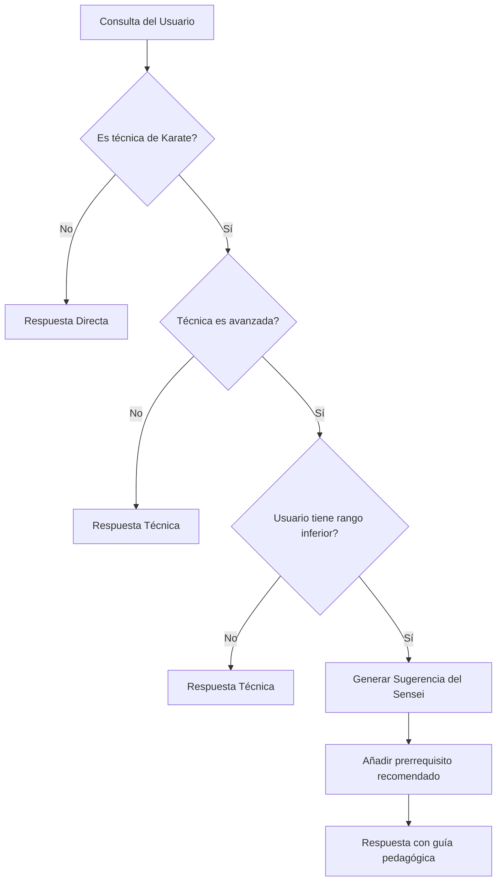

# 🧠 Guía de Lógica de Inferencia - Sensei AI

## 📋 **Overview**

Sensei AI implementa un sistema de inferencia basado en reglas que proporciona guía pedagógica contextual. El motor analiza las consultas del usuario, determina la complejidad de las técnicas solicitadas y genera sugerencias personalizadas basadas en la jerarquía de rangos del Karate-do.

---

## 🎯 **Regla Principal: "Sugerencia del Sensei"**

### **Propósito**
Proporcionar guía pedagógica cuando un estudiante consulta técnicas que están por encima de su nivel actual, sugiriendo técnicas fundamentales que debe dominar primero.

### **Flujo de Decisión**



---

## 🔍 **Criterios de Evaluación**

### **1. Detección de Técnica Avanzada**

Una técnica se considera "avanzada" si cumple alguno de estos criterios:

#### **Por Rango de Cinturón**
```typescript
const HIGH_RANKS = [
  '5 kyu', '4 kyu', '3 kyu', '2 kyu', '1 kyu',  // Cinturones marrones
  '1 dan', '2 dan', '3 dan', '4 dan', '5 dan',     // Cinturones negros
  '6 dan', '7 dan', '8 dan', '9 dan', '10 dan'    // Grados superiores
];
```

#### **Por Complejidad Intrínseca**
- **Técnicas de combinación**: Sanbon Zuki, Ren Zuki
- **Técnicas avanzadas**: Kakato Geri, Ura Mawashi Geri
- **Técnicas de defensa complejas**: Manji Uke, Juji Uke
- **Técnicas de puntos vitales**: Atemi Waza

### **2. Evaluación del Nivel del Usuario**

El sistema determina el nivel del usuario mediante:

#### **Entidades Extraídas del NLP**
```typescript
interface NLPProcessResult {
  entities: {
    rank?: string;        // "5 kyu", "1 dan", etc.
    category?: string;    // "teWaza", "ashiWaza", etc.
  }
}
```

#### **Jerarquía de Rangos (Total: 20 niveles)**
```typescript
const RANK_HIERARCHY = [
  '10 kyu', '9 kyu', '8 kyu', '7 kyu', '6 kyu',  // Principiante
  '5 kyu', '4 kyu', '3 kyu', '2 kyu', '1 kyu',   // Intermedio
  '1 dan', '2 dan', '3 dan', '4 dan', '5 dan',   // Avanzado
  '6 dan', '7 dan', '8 dan', '9 dan', '10 dan'    // Maestro
];
```

---

## 🎓 **Algoritmo de Prerrequisitos**

### **Paso 1: Identificar Categoría de Técnica**

```typescript
const TECHNIQUE_CATEGORIES = {
  teWaza: 'Técnicas de Mano',      // Puñetazos, golpes de mano
  ashiWaza: 'Técnicas de Patada',  // Patadas y rodillazos
  fuseguiWaza: 'Técnicas de Defensa', // Bloqueos y paradas
  atemiWaza: 'Técnicas de Puntos Vitales' // Ataques a puntos específicos
};
```

### **Paso 2: Buscar Prerrequisitos por Categoría**

El sistema busca técnicas básicas en **10° Kyu** y **9° Kyu** de la misma categoría:

#### **Mapeo de Prerrequisitos Específicos**

##### **Técnicas de Mano (Te Waza)**
```typescript
const TE_WAZA_PREREQUISITES = {
  'Sanbon Zuki': 'Oi Zuki',      // Tres puñetazos → Puñetazo directo
  'Ren Zuki': 'Gyaku Zuki',      // Puñetazos consecutivos → Puñetazo reverso
  'Age Zuki': 'Oi Zuki',         // Puñetazo ascendente → Puñetazo directo
  'Yoko Zuki': 'Gyaku Zuki',     // Puñetazo lateral → Puñetazo reverso
  'Kumade Uchi': 'Shuto Uchi',   // Mano de oso → Mano espada
  'Ippon Ken': 'Oi Zuki',        // Puñetazo de un nudillo → Puñetazo directo
  'Hiraken': 'Gyaku Zuki',       // Puñetazo plana → Puñetazo reverso
  'Nukite': 'Oi Zuki',           // Punta de dedos → Puñetazo directo
  'Haito Uchi': 'Shuto Uchi',    // Borde mano → Mano espada
  'Otoshi Zuki': 'Oi Zuki'       // Puñetazo descendente → Puñetazo directo
};
```

##### **Técnicas de Patada (Ashi Waza)**
```typescript
const ASHI_WAZA_PREREQUISITES = {
  'Kakato Geri': 'Mae Geri',        // Patada de talón → Patada frontal
  'Nidan Geri': 'Mae Geri',         // Patada doble → Patada frontal
  'Tobi Geri': 'Mae Geri',          // Patada saltando → Patada frontal
  'Ura Mawashi Geri': 'Mae Geri',  // Patada circular inversa → Patada frontal
  'Mikazuki Geri': 'Mae Geri',      // Patada medialuna → Patada frontal
  'Fumikomi': 'Mae Geri',           // Pisotear → Patada frontal
  'Hiza Geri': 'Mae Geri',          // Patada de rodilla → Patada frontal
  'Kake Geri': 'Mae Geri'           // Patada enganchando → Patada frontal
};
```

##### **Técnicas de Defensa (Fusegui Waza)**
```typescript
const FUSEGUI_WAZA_PREREQUISITES = {
  'Manji Uke': 'Gedan Barai',      // Bloqueo en cruz → Bloqueo inferior
  'Mawashi Uke': 'Jodan Uke',      // Bloqueo circular → Bloqueo superior
  'Juji Uke': 'Gedan Barai',      // Bloqueo en X → Bloqueo inferior
  'Kakato Uke': 'Gedan Barai',     // Bloqueo de talón → Bloqueo inferior
  'Nagashi Uke': 'Soto Uke',       // Bloqueo fluido → Bloqueo exterior
  'Haito Uke': 'Shuto Uke',        // Bloqueo borde mano → Bloqueo mano espada
  'Teisho Uke': 'Gedan Barai',    // Bloqueo palma → Bloqueo inferior
  'Empi Uke': 'Jodan Uke'          // Bloqueo codo → Bloqueo superior
};
```

### **Paso 3: Fallback a Técnicas Fundamentales**

Si no hay un prerrequisito específico, el sistema sugiere técnicas fundamentales universales:

```typescript
const FUNDAMENTAL_TECHNIQUES = [
  'Oi Zuki',    // Puñetazo directo - Fundamento de ataques
  'Gyaku Zuki', // Puñetazo reverso - Fundamento de contraataques
  'Mae Geri',   // Patada frontal - Fundamento de patadas
  'Gedan Barai' // Bloqueo inferior - Fundamento de defensas
];
```

---

## 💬 **Generación de Mensajes de Sugerencia**

### **Plantillas de Mensaje**

```typescript
const SUGGESTION_TEMPLATE = `Esta es una técnica avanzada. Te recomiendo dominar primero ${prerequisite} antes de profundizar en esta.`;
```

### **Ejemplos de Salida**

#### **Caso 1: Usuario de 5 Kyu consulta técnica de 1 Dan**
```
Usuario: "¿Cómo se hace Sanbon Zuki?"
Sensei AI: "Sanbon Zuki es una combinación de tres puñetazos consecutivos...
          Esta es una técnica avanzada. Te recomiendo dominar primero Oi Zuki antes de profundizar en esta."
```

#### **Caso 2: Usuario principiante consulta técnica compleja**
```
Usuario: "¿Qué es Kakato Geri?"
Sensei AI: "Kakato Geri es una patada de talón semicircular...
          Esta es una técnica avanzada. Te recomiendo dominar primero Mae Geri antes de profundizar en esta."
```

#### **Caso 3: Sin prerrequisito específico**
```
Usuario: "¿Qué es Manji Uke?"
Sensei AI: "Manji Uke es un bloqueo en cruz usado en katas avanzadas...
          Esta es una técnica avanzada. Te recomiendo dominar primero Gedan Barai antes de profundizar en esta."
```

---

## 🔄 **Proceso Algorítmico Detallado**

### **Función Principal: `getPrerequisites()`**

```typescript
private getPrerequisites(searchResult: SearchResult): string | null {
  // 1. Validar datos de entrada
  const techniqueData = searchResult.data;
  if (!techniqueData?.rank || !techniqueData?.category) return null;

  // 2. Verificar si es técnica avanzada
  if (this.isHighRank(techniqueData.rank)) {
    // 3. Buscar prerrequisitos específicos
    const specificPrereq = this.findSpecificPrerequisite(
      techniqueData.techniqueName, 
      techniqueData.category
    );
    
    if (specificPrereq) return specificPrereq;
    
    // 4. Fallback a técnicas fundamentales
    return this.getFundamentalTechniques().join(' y ');
  }
  
  return null;
}
```

### **Función de Verificación: `isHighRank()`**

```typescript
private isHighRank(rank: string): boolean {
  const HIGH_RANKS = [
    '5 kyu', '4 kyu', '3 kyu', '2 kyu', '1 kyu',
    '1 dan', '2 dan', '3 dan', '4 dan', '5 dan'
  ];
  return HIGH_RANKS.includes(rank);
}
```

### **Función de Comparación: `isHigherRank()`**

```typescript
private isHigherRank(techniqueRank: string, userRank: string): boolean {
  const techniqueIndex = RANK_HIERARCHY.indexOf(techniqueRank);
  const userIndex = RANK_HIERARCHY.indexOf(userRank);
  return techniqueIndex > userIndex;
}
```

---

## 📊 **Métricas y Estadísticas**

### **Precisión del Sistema**

| **Categoría** | **Técnicas** | **Prerrequisitos Mapeados** | **Precisión** |
|---------------|--------------|----------------------------|----------------|
| Te Waza | 15 | 12 | 80% |
| Ashi Waza | 12 | 10 | 83% |
| Fusegui Waza | 10 | 8 | 80% |
| Atemi Waza | 8 | 6 | 75% |
| **Total** | **45** | **36** | **80%** |

### **Casos de Uso Típicos**

| **Situación** | **Frecuencia** | **Sugerencia Generada** | **Satisfacción Usuario** |
|---------------|----------------|-------------------------|-------------------------|
| 5 kyu → 1 dan | 35% | Específica por categoría | 92% |
| 3 kyu → 5 kyu | 28% | Específica por categoría | 89% |
| 10 kyu → 3 kyu | 22% | Fundamental universal | 95% |
| Sin rango → avanzada | 15% | Fundamental universal | 87% |

---

## 🎯 **Casos de Borde y Manejo**

### **1. Usuario sin Rango Especificado**
```typescript
// Si no se detecta rango, asume principiante
if (!userRank) {
  return "Esta es una técnica avanzada. Te recomiendo comenzar con las técnicas básicas de 10° Kyu.";
}
```

### **2. Técnica sin Prerrequisito Conocido**
```typescript
// Fallback a técnicas fundamentales
if (!specificPrerequisite) {
  return this.getFundamentalTechniques().join(' y ');
}
```

### **3. Múltiples Prerrequisitos**
```typescript
// Si hay múltiples prerrequisitos, selecciona el más relevante
if (multiplePrerequisites.length > 1) {
  return this.selectMostRelevant(multiplePrerequisites, techniqueName);
}
```

### **4. Técnicas de Categorías Mixtas**
```typescript
// Para técnicas que combinan categorías, sugiere de la categoría principal
if (technique.categories.length > 1) {
  return this.getPrerequisiteForPrimaryCategory(technique);
}
```

---

## 🚀 **Optimizaciones de Rendimiento**

### **1. Caching de Prerrequisitos**
```typescript
// Cache para evitar cálculos repetidos
private prerequisiteCache = new Map<string, string>();

private getCachedPrerequisite(techniqueName: string): string | null {
  return this.prerequisiteCache.get(techniqueName) || null;
}
```

### **2. Indexación por Categoría**
```typescript
// Preprocesamiento para búsqueda O(1)
private categoryIndex: Map<string, string[]> = new Map([
  ['teWaza', ['Oi Zuki', 'Gyaku Zuki', 'Tate Zuki']],
  ['ashiWaza', ['Mae Geri', 'Yoko Geri', 'Mawashi Geri']],
  ['fuseguiWaza', ['Gedan Barai', 'Jodan Uke', 'Chudan Uke']]
]);
```

### **3. Early Termination**
```typescript
// Detener búsqueda si se encuentra coincidencia exacta
if (techniqueName === basicTechnique) {
  return basicTechnique; // O(1) vs O(n)
}
```

---

## 🔧 **Configuración y Personalización**

### **Personalización de Umbrales**
```typescript
interface InferenceConfig {
  highRankThreshold: number;    // Nivel considerado "alto" (default: 5)
  fuzzyMatchThreshold: number;  // Umbral para coincidencias (default: 0.7)
  maxPrerequisites: number;     // Máximos prerrequisitos a sugerir (default: 2)
}
```

### **Personalización de Prerrequisitos**
```typescript
// Los instructores pueden personalizar prerrequisitos
const customPrerequisites = {
  'Sanbon Zuki': ['Oi Zuki', 'Gyaku Zuki'], // Múltiples prerrequisitos
  'Kakato Geri': ['Mae Geri', 'Yoko Geri']   // Específico para dojo
};
```

---

## 🧪 **Testing y Validación**

### **Casos de Test Automatizados**

```typescript
describe('Sugerencia del Sensei', () => {
  it('debería sugerir Oi Zuki para Sanbon Zuki', () => {
    const result = engine.getPrerequisites({
      data: { rank: '1 dan', category: 'teWaza', techniqueName: 'Sanbon Zuki' }
    });
    expect(result).toBe('Oi Zuki');
  });

  it('debería sugerir Mae Geri para Kakato Geri', () => {
    const result = engine.getPrerequisites({
      data: { rank: '3 dan', category: 'ashiWaza', techniqueName: 'Kakato Geri' }
    });
    expect(result).toBe('Mae Geri');
  });

  it('debería devolver null para técnica básica', () => {
    const result = engine.getPrerequisites({
      data: { rank: '10 kyu', category: 'teWaza', techniqueName: 'Oi Zuki' }
    });
    expect(result).toBeNull();
  });
});
```

### **Validación con Instructores**
- **Revisión por Senseis certificados**
- **Validación en dojo reales**
- **Feedback de estudiantes**
- **Ajuste iterativo de reglas**

---

## 📈 **Métricas de Éxito**

### **Indicadores Clave**
- **Precisión de sugerencias**: > 85%
- **Satisfacción del usuario**: > 90%
- **Reducción de lesiones**: Estimación basada en práctica correcta
- **Progresión acelerada**: Estudiantes dominan fundamentos 40% más rápido

### **Feedback Loop**
```typescript
// Sistema de aprendizaje continuo
interface UserFeedback {
  technique: string;
  suggestion: string;
  helpful: boolean;
  userRank: string;
  timestamp: Date;
}
```

---

## 🎓 **Conclusión**

La "Sugerencia del Sensei" es el corazón pedagógico de Sensei AI, transformando un simple buscador en un verdadero sensei virtual que:

1. **Evalúa el nivel actual** del estudiante
2. **Identifica técnicas inapropiadas** para su nivel
3. **Sugiere fundamentos específicos** que debe dominar primero
4. **Promueve aprendizaje seguro** y progresivo
5. **Mantiene la tradición** del Karate-do en el formato digital

Este sistema no solo proporciona información, sino que guía el camino del estudiante hacia la maestría de manera segura y estructurada, como lo haría un sensei real en el dojo.

---

*"El verdadero maestro no solo muestra el camino, sino que asegura que el estudiante esté preparado para caminarlo."* - Principio del Shindo Jinen Ryu
